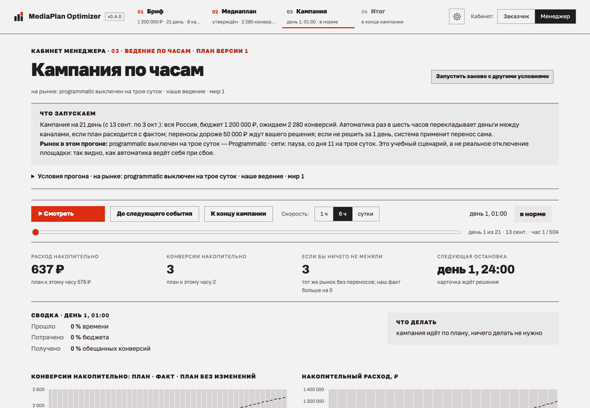
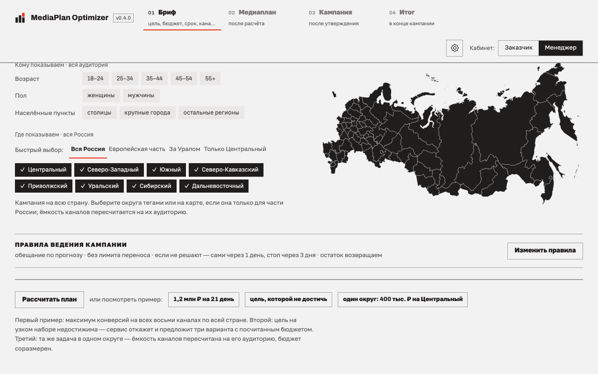
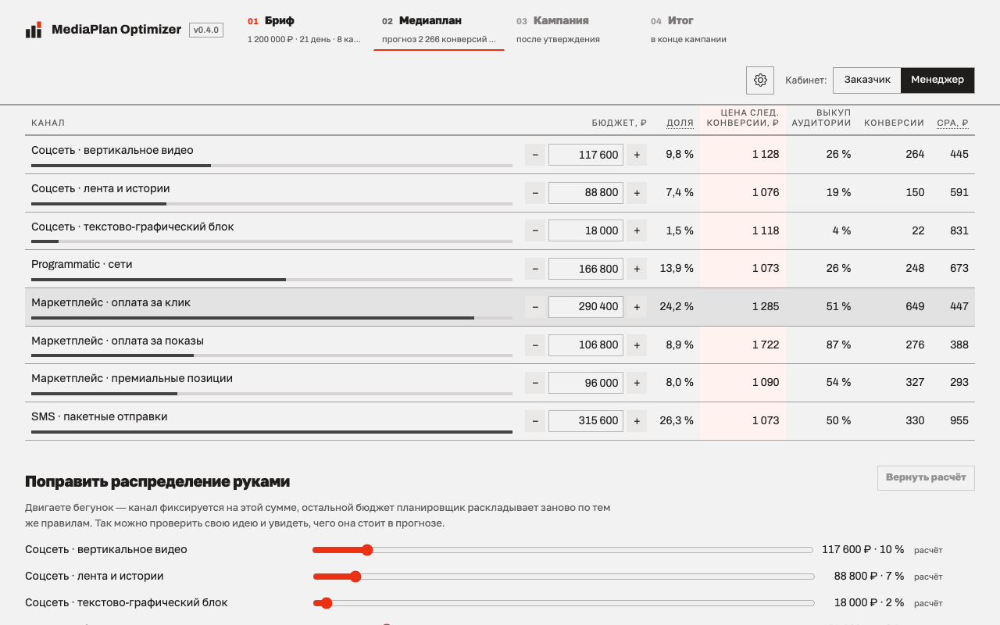
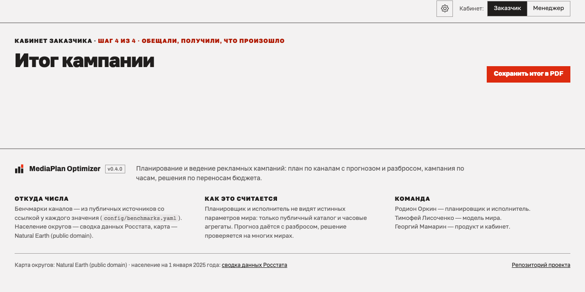
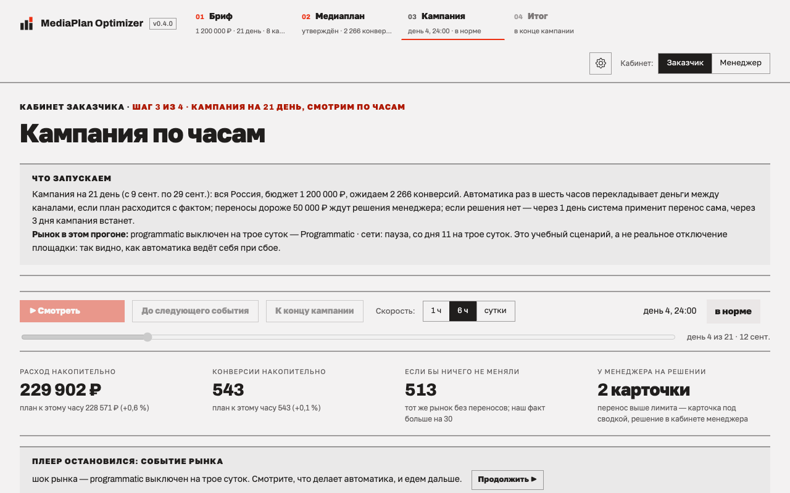
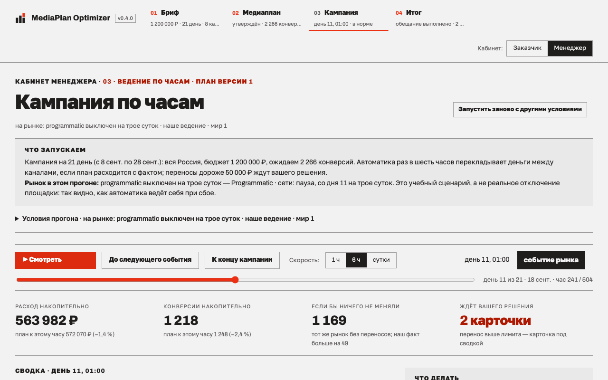

<h1>
<picture>
    <source media="(prefers-color-scheme: dark)" srcset="docs/figures/logo-dark.svg">
    
</picture> MediaPlan Optimizer
</h1>

[](https://github.com/dmagog/mediaplan-optimizer/actions/workflows/ci.yml)

Убираем ручную сборку медиаплана и лаг перераспределения бюджета: прогнозная
модель и план работают как одна система управления кампанией.

Сервис собирает медиаплан по восьми каналам, ведёт кампанию час за часом и
перекладывает бюджет, когда рынок расходится с планом. Мелкие переносы делает
сам, крупные приносит человеку карточкой с разбором: почему, что будет, если
сделать, и что будет, если не делать.

Каналы абстрактные, рынок — симулятор. Мы не выдаём модельные CPM и CTR за
статистику площадок.



## Зачем

**До запуска.** Медиапланер собирает распределение в Excel по средним
показателям рынка — рабочий день на бриф, а поменялся бриф, и считай заново.
Сравнить каналы между собой и цель с ёмкостью рынка нечем.

**После запуска.** Трафик-менеджер сверяет факт раз в день и перекладывает
бюджет руками: ещё 0,5–2 часа каждый день кампании. Сравнить сегодняшнюю цифру
с плановой траекторией тоже нечем.

По нашей оценке это 120–180 тыс. ₽ на кампании 1,2 млн ₽ за три недели, если
перераспределение 10–15 % бюджета опоздало; у команды, которая ведёт 20–40
кампаний в год и промахивается в каждой четвёртой, за год набегает 0,6–1,8 млн
₽ и десятки человеко-дней. Расчёт — в [описании проекта](docs/PROJECT.md).

Сервис закрывает оба разрыва: план за 0,1 секунды вместо рабочего дня и
ведение по часам вместо ежедневной сверки. Медиапланер работает с ним до
запуска, трафик-менеджер во время кампании, рекламодатель смотрит в кабинете
заказчика, достижим ли KPI и куда уходят деньги. Все трое видят вторую
величину: разброс возможных значений вместо одной точки, цену решения и цену
бездействия по каждому ходу.

## Запуск

```bash
docker compose up                                  # кабинет на http://localhost:8000
docker compose --profile tests run --rm tests      # тесты
docker compose --profile demos run --rm demos      # три демо и стенд → results/
```

Без Docker:

```bash
uv venv .venv && uv pip install --python .venv/bin/python -e ".[dev]"
.venv/bin/uvicorn app.main:app --port 8000
.venv/bin/python -m pytest -q
.venv/bin/python scripts/run_demos.py --seeds 20
```

Кампания в 21 день считается за секунды: план 0,1 с, прогон около 1,5 с, стенд
4 стратегий на 20 парных мирах и 5 сценариях — около 8 минут, на 100 мирах
около 40 минут (время каждого прогона пишется в конец `results/report.md`).

## Демонстрация, ноутбук и отчёт

| Артефакт | Где | Как пересобрать |
|---|---|---|
| Скринкаст, 2,6 минуты: постановки A и B, план, кампания, экран недостижимости | [docs/screencast.mp4](docs/screencast.mp4) | `python scripts/record_screencast.py` (нужен Playwright) |
| Снимки кабинета и гифка плеера: 15 экранов обоих кабинетов | [docs/figures/cabinet](docs/figures/cabinet) | `python scripts/shoot_cabinet.py` (нужны Playwright и Pillow) |
| Ноутбук со сквозным сценарием и выводами | [notebooks/demo.ipynb](notebooks/demo.ipynb) | `.venv/bin/python scripts/build_demo_notebook.py` |
| Итоговый отчёт одним файлом | [report/report.html](report/report.html) | `.venv/bin/python scripts/build_report.py` |

Ноутбук проходит весь путь на пакетах проекта: каталог, план типа A, метрики
по плану целиком, недостижимая цель типа B с готовыми ходами, кампания по
часам с шоком и решением человека, итог. Отчёт собирается из README
и документов репозитория, картинки вшиты внутрь файла.

## Что делает сервис

| Экран | Что происходит |
|---|---|
| Бриф | бюджет или цель, срок, каналы, география федеральными округами, сегмент аудитории, правила ведения |
| Медиаплан | распределение по каналам с прогнозом и разбросом; недостижимую цель отклоняет и даёт варианты с посчитанным бюджетом; если размещён не весь бюджет, объясняет почему |
| Кампания | час за часом: статус, переносы бюджета, карточки решений дороже лимита, шоки рынка |
| Итог | обещали, получили, что дало ведение против плана без изменений |

Кабинетов два, переключает их кнопка в шапке. Заказчик видит план, ход
кампании и итог; менеджер — то же плюс решения по переносам, сценарии рынка
и стенды. Экраны, правила ведения, география и ручная правка описаны в
[docs/cabinet.md](docs/cabinet.md).

## Шесть сценариев, ради которых всё сделано

Сценарии собраны из кабинетного исследования по шести аудиториям: медиапланер,
трафик-менеджер, рекламодатель, руководитель агентства, аналитик, закупщик.
Каждый разобран до кнопки, а где именно он живёт в коде — в
[docs/traceability.md](docs/traceability.md).

| | Кто и когда | Что делает сервис |
|---|---|---|
| **С1** | Медиапланер получил бриф: 1,2 млн ₽, 21 день, нужны конверсии | Раскладывает бюджет по каналам, показывает цену следующей конверсии и разброс прогноза, даёт поправить руками и утвердить версию плана |
| **С2** | Клиенту нужно 50 000 кликов за 14 дней, бюджет не назван | Считает достижимость. Если цель недостижима, называет максимум, во что упирается (ёмкость, срок, набор каналов или потолок цены), и ходы с посчитанным бюджетом |
| **С3** | План утверждён, деньги ещё не потрачены | Репетиция: прогоняет план через девять шоков рынка и говорит, где он выдерживает, а где ломается |
| **С4** | Трафик-менеджер ведёт кампанию по часам | Держит темп расхода, показывает статус вместо дашборда и сводку «что произошло и что делать» на каждый час |
| **С5** | Середина кампании, рынок изменился | Переносит бюджет сам в пределах лимита, а дороже лимита приносит карточку с ценой решения и ценой бездействия; решение откатывается |
| **С6** | Кампания закончилась, нужен разговор с клиентом | Собирает итог: обещали, получили, что дало ведение против плана без изменений, и сравнивает стратегии на 20 парных мирах прямо в кабинете (100 миров — офлайн-стенд) |

## Экраны кабинета

Бриф: кому показываем и где. Сегмент сужает аудиторию канала, округа — долю
страны; ёмкость каналов пересчитывается на выбранное.



Медиаплан: бюджет канала правится прямо в строке, остальное планировщик
раскладывает заново.



Итог для заказчика: что обещали, что получили, что дало ведение.



Одна и та же кампания в двух кабинетах: заказчик видит ход и события, менеджер
решает по карточкам.

<table>
<tr>
<td width="50%"></td>
<td width="50%"></td>
</tr>
<tr>
<td align="center">кабинет заказчика</td>
<td align="center">кабинет менеджера</td>
</tr>
</table>

Остальные экраны обоих кабинетов — в
[docs/figures/cabinet](docs/figures/cabinet), назначение каждого снимка — в
[docs/materials.md](docs/materials.md).

## Архитектура: пять пакетов

| Пакет | Роль |
|---|---|
| `contracts/` | схемы границ: каталог, наблюдение, действие, бриф, план, решение |
| `world/` | модель рынка и симулятор: `reset / step / inject_shock`, профили каналов, сценарии шоков |
| `brain/` | планировщик (две постановки задачи, диагностика отказа) и исполнитель (два контура, детектор слома) |
| `harness/` | стенд: ретро-пробы, цикл прогона, метрики, парное сравнение стратегий |
| `app/` | FastAPI и веб-кабинет |

**Информационная граница.** `brain` не импортирует `world` — это проверяют
import-linter и тест. Планировщик видит только публичный каталог диапазонов и
ретро-историю: часовые отчёты пробных кампаний из прошлых миров. Смена зерна
оцениваемого мира план не меняет (`tests/test_isolation.py`), поэтому
расхождение плана с фактом не подстроено: оно возникает само.

**Рынок.** Трафик идёт по Пуассону с суточным профилем недели. Цена —
лог-нормальный ландшафт: она растёт с выкупом инвентаря, а показы упираются
в потолок. Охват считается по модели случайного размещения, усталость
аудитории снижает CTR с частотой, шум автокоррелирован. Случайность адресуется
ключом «зерно, час, канал, событие», поэтому стратегии сравниваются на одной
ленте событий.

**Планировщик.** Кривые «дневной бюджет → показы» строятся из ретро-истории.
Бюджет раскладывается жадным алгоритмом (water-filling): очередная порция
доливается в канал с наибольшей предельной отдачей, пока отдачи не сравняются
(Little & Lodish, 1969; тот же приём в Meridian и Robyn). Вторая постановка
задачи — бисекция по бюджету, отказ с диагнозом и готовыми ходами.

**Исполнитель.** Внешний контур раз в шесть часов и по событию перерешает
остаток на кривых, поправленных фактом; внутренний держит темп расхода.
Детектор слома — резкого падения отдачи канала — сравнивает сутки с тремя
предыдущими, с поправкой на плановую усталость аудитории. Правило резерва
определяет, тратить ли остаток: доля выбирается так, чтобы недорасход равнялся
перевыполнению.

Подробно: [docs/report.md](docs/report.md) — правила распределения и
перераспределения, [docs/research.md](docs/research.md) — первоисточники
методов, [docs/decisions.md](docs/decisions.md) — журнал решений: что
проверено и что отвергнуто.

## Результаты стенда

План демо 1 (2 280 конверсий за 1 200 000 ₽), 100 парных миров на одной ленте
случайности. «В пороге» — доля миров, где и расход, и результат отклонились не
больше чем на 20 %.

| Сценарий | Заморозка: расход / KPI / в пороге | Наша: расход / KPI / в пороге | Побед по KPI |
|---|---|---|---|
| без шока | 2,2 % / 23,4 % / 45 % | 14,2 % / 16,9 % / 60 % | 84 % |
| CTR −40 % в крупном канале | 2,2 % / 18,8 % / 54 % | 12,3 % / 14,8 % / 65 % | 83 % |
| CPM ×2 | 1,9 % / 20,0 % / 50 % | 12,7 % / 15,5 % / 64 % | 84 % |
| пауза канала | 4,2 % / 21,8 % / 47 % | 14,0 % / 16,3 % / 61 % | 85 % |
| SMS-база −50 % | 2,2 % / 23,4 % / 45 % | 14,4 % / 17,8 % / 61 % | 86 % |

Заморозка тратит бюджет по плану, но результат гуляет: медиана отклонения
около 23 %, в щедрых мирах до 120 % — миры отличаются от каталога. Наша
стратегия уравнивает два отклонения: если мир щедрее плана, часть бюджета не
тратится. В пороге по обоим отклонениям 60 % миров против 45 % у заморозки.

Резерв настраивается. Тот же исполнитель на тех же мирах:

| Режим (без шока, 100 миров) | Недорасход, среднее | Отклонение KPI, медиана | Оба в пороге | KPI в среднем |
|---|---|---|---|---|
| заморозка (план буквально) | 2,2 % | 23,4 % | 45 % | 2 616 |
| держать KPI на плане | 27,3 % | 0,2 % | 28 % | 2 184 |
| держать план, баланс (по умолчанию) | 14,2 % | 16,9 % | 60 % | 2 506 |
| выжимать максимум | 0,3 % | 27,3 % | 37 % | 2 754 |

Числа в таблицах выше переносит из артефактов скрипт
`scripts/sync_doc_numbers.py`, а с ключом `--check` он только сверяет и
падает на расхождении. Таблицу режимов считает `scripts/run_modes.py`.
Гистограммы перерисовывает `scripts/build_stand_figures.py` из готового
`results/comparison.json` — для этого нужен matplotlib, в зависимостях
проекта его нет. Какой режим включать — решение клиента, разбор в
[docs/business_position.md](docs/business_position.md). Полный отчёт:
`results/report.md`, гистограммы по мирам — `docs/figures/stand_hist_*.png`.

## Границы и упрощения

**Ни одного числа из головы.** У каждой константы есть происхождение:

- `config/benchmarks.yaml` — публичные бенчмарки со ссылками;
- `config/assumptions.yaml` — допущения рынка с диапазоном и обоснованием;
- `config/controller.yaml` — константы исполнителя;
- `config/geo.yaml` — население федеральных округов.

`tests/test_provenance.py` падает, если у значения нет источника или теста
калибровки.

**Что сознательно упрощено.** Цена задаётся лог-нормальным ландшафтом, а не
аукционом второй цены. Охват — модель случайного размещения, аудитории каналов
пересекаются только попарно. Конверсии мгновенные. Региональные цены не
моделируются: география меняет ёмкость, но не стоимость контакта. MMM,
мультитач и обучение на логах ставок вне рамок кейса.

**Экспериментальное, по умолчанию выключено.** ML-лаборатория: детектор
качества трафика, обученные кривые отклика, коррекция пересечений охвата —
[docs/ML_FEATURES.md](docs/ML_FEATURES.md), проверка на 30 парных мирах в
`results/ml_validation.md`. Включается она только в стенде и скриптах, а не в кабинете: поля `ml` у
HTTP-API нет.

**Что в мире включено всегда.** Попарные пересечения аудиторий (10 % меньшего
пула) и фоновая доля ботов в programmatic (3 %) работают в каждом прогоне.
Внешние конкуренты и недельная квота SMS включаются настройками стенда —
[docs/world/EXTENSIONS.md](docs/world/EXTENSIONS.md). Почему модели рынка
можно верить — [docs/WORLD_CREDIBILITY.md](docs/WORLD_CREDIBILITY.md).

## Документы

Полный указатель — [docs/README.md](docs/README.md). Главное:

| Документ | О чём |
|---|---|
| [docs/cabinet.md](docs/cabinet.md) | кабинет: экраны, два кабинета, правила ведения, география, ручная правка |
| [docs/PROJECT.md](docs/PROJECT.md) | описание проекта целиком |
| [docs/product.md](docs/product.md) | продуктовая постановка и пользователи |
| [docs/traceability.md](docs/traceability.md) | сценарии С1–С6 и где каждый реализован |
| [docs/report.md](docs/report.md) | правила распределения и перераспределения |
| [docs/research.md](docs/research.md) | первоисточники методов |
| [docs/decisions.md](docs/decisions.md) | журнал решений: что проверено и что отвергнуто |

## Разработка

Ветки: `main` — рабочая, `feature/*` — по модулям. Стиль `ruff check .`,
граница пакетов `lint-imports`, тесты `pytest -q`.

**Команда.** Родион Оркин — планировщик и исполнитель. Тимофей Лисоченко —
модель рынка. Георгий Мамарин — продукт и кабинет.
