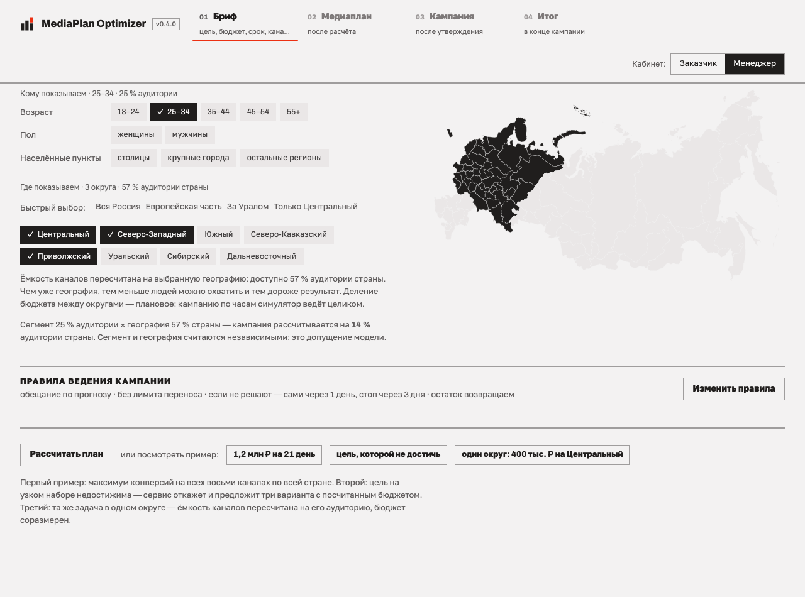
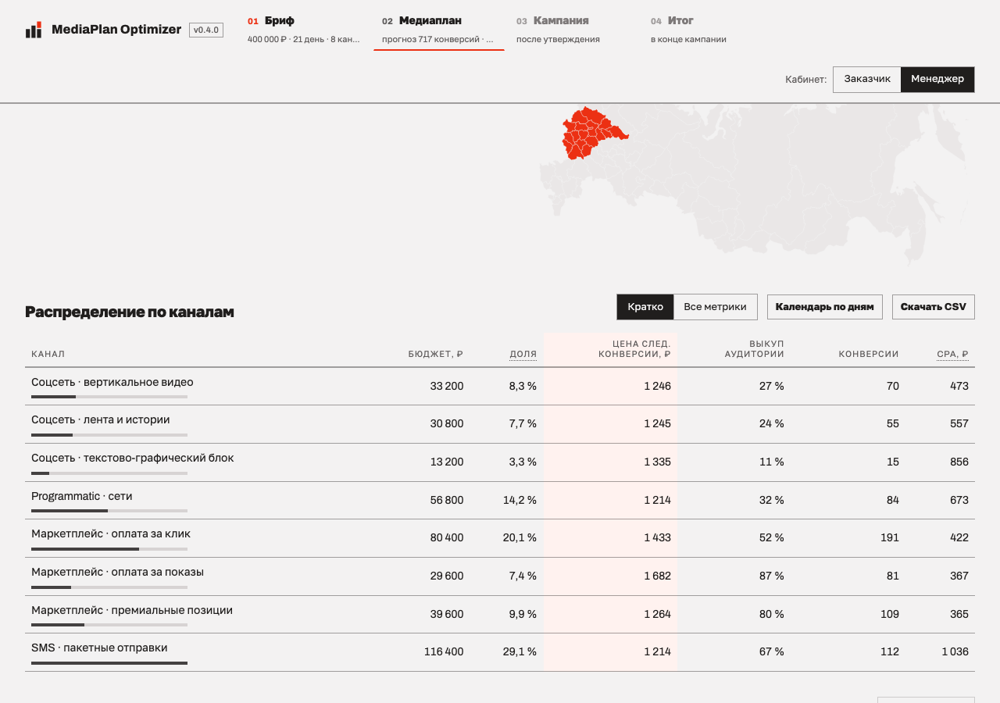
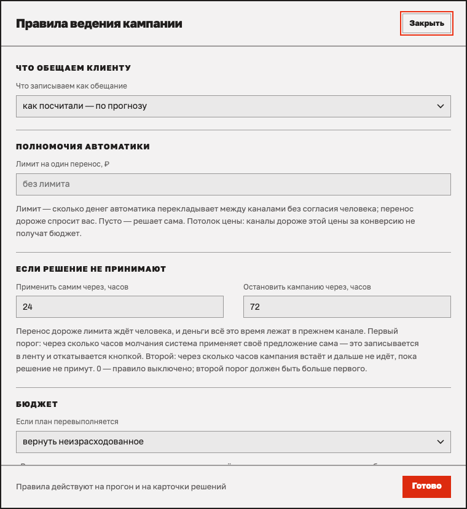
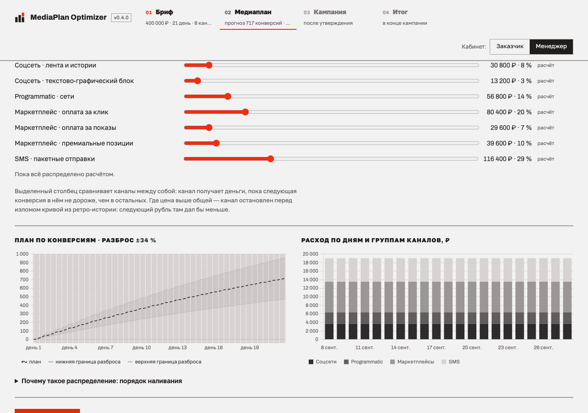

# MediaPlan Optimizer

Прототип сервиса медиапланирования и почасового удержания плана для кейса
МТС «Media Planning & Optimisation Tool». Замкнутый контур
«бриф → медиаплан → почасовая симуляция → перераспределение» на восьми
абстрактных каналах: три соцсети, programmatic, три маркетплейса, SMS.

Каналы абстрактные, данные синтетические. Это прототип планирования и
управления темпом расходования, не система закупок и не рекомендация тратить
реальные средства. Модельные CPM и CTR не являются статистикой какой-либо
площадки.

## Запуск

```bash
docker compose up                 # кабинет на http://localhost:8000
docker compose --profile tests run --rm tests     # тесты
docker compose --profile demos run --rm demos     # три демо и стенд на 20 мирах → results/
```

Без Docker:

```bash
uv venv .venv && uv pip install --python .venv/bin/python -e ".[dev]"
.venv/bin/uvicorn app.main:app --port 8000
.venv/bin/python -m pytest -q
.venv/bin/python scripts/run_demos.py --seeds 20
```

Кампания в 21 день считается за секунды: план 0,1 с, прогон адаптивной
стратегии около 1,5 с, стенд четырёх стратегий на 20 парных мирах и пяти
сценариях около пяти минут.

## Три демонстрации в кабинете

Кабинет собран по дизайн-системе Modernist (Claude Design): четыре экрана
«01 Бриф · 02 Медиаплан · 03 Кампания · 04 Итог», по одному за раз, шаги —
кнопками в липкой шапке. Справа в шапке переключатель «Кабинет: Заказчик /
Менеджер» — два интерфейса одной страницей, как просил кейсодатель.
**Кабинет заказчика** — бриф, план с обещанием, кампания по часам, итог;
переносы выше лимита он видит, но решает их менеджер. **Кабинет менеджера** —
то же плюс карточки решений и техника: сценарии рынка, свои шоки, стратегии,
зерно мира, стресс-тест, сравнение на 20 мирах, таблица часа, вердикт с
зёрнами. Имя кабинета стоит первым словом на каждом экране. Выбор
запоминается в браузере; адрес `/?role=customer` открывает кабинет заказчика
принудительно, `/?role=manager` — менеджера (старые `?level=simple|tech`
работают). Шрифты Archivo и Golos Text лежат в `app/static/vendor/fonts`,
демо не зависит от сети.

1. **Демо 1: бюджет есть, нужен максимум результата.** Кнопка-пример «1,2 млн ₽ на 21 день» на экране
   брифа. Бриф: задача, бюджет, срок, обещание «по прогнозу» или «с
   запасом», каналы пресетом или любым набором чипов, география — тегами
   федеральных округов или кликом по карте России. Под «Дополнительно» —
   потолок CPA, лимит на один перенос, режим «вернуть неизрасходованное /
   потратить весь бюджет». Плитки плана: прогноз с CPA, разброс, бюджет, самый
   загруженный канал; при обещании с запасом — плитка «Обещаем» с нижней
   границей разброса; в кабинете менеджера — время расчёта. Таблица каналов: бюджет,
   доля, выделенный столбец «цена следующей конверсии», показы, охват, клики,
   конверсии, CTR, VTR (допущение, со сноской), CR, CPM, CPC, CPA, частота,
   выкуп аудитории. Ниже календарь по дням (свёрнут) и графики траектории с
   разбросом; в кабинете менеджера — раскрывающийся блок «Как распределяли». Кнопки:
   «Утвердить план» (открывает ведение), «Что если бюджет ±10 %», в кабинете менеджера —
   «Стресс-тест: прогнать план через шоки» (семь шоков на одном мире).
2. **Демо 2: цель есть, нужен бюджет.** Кнопка-пример «цель, которой не достичь». Вердикт: недостижимо, максимум, на сколько меньше цели, во
   что упирается. Три варианта от дешёвого к дорогому с ценой за клик и меткой
   «дешевле всего»: добавить каналы, снизить цель, увеличить срок. Каждый
   применяется одной кнопкой и меняет бриф; набор каналов виден в чипах. На
   всех восьми каналах цель достижима, сервис называет медианный бюджет. При
   обещании «с запасом» бюджет считается с резервом, чтобы цель держалась и по
   нижней границе разброса; если резерв недостижим, кабинет говорит об этом и
   показывает план без запаса.
3. **Демо 3: шок рынка и ведение по часам.** Экран «Кампания по часам»
   открывается после утверждения. В кабинете менеджера условия прогона лежат
   в раскрывающемся блоке: рынок выбирается карточками с
   описанием события (канал, что ломается, сила, со дня и на сколько; события
   за горизонтом помечены), сверху — до трёх своих шоков чипами. Кнопка
   «Запустить кампанию» подписана тем, что случится на рынке. Прогон считается
   целиком за секунды, плеер идёт шагом 6 часов и останавливается на шоке,
   сломе и карточках. На экране: статус «в норме / наблюдаем / пожар», плитки
   расхода и результата против плана, «План без изменений дал бы», графики
   план — факт — план без изменений с меткой шока, стек долей по дням, блоки
   «Что происходило» и «Переносы бюджета» с карточками «Почему / Если сделать /
   Если не делать». Перенос выше лимита ждёт человека: «Перенести» или
   «Оставить как есть»; решение перепрогоняет кампанию на тех же случайных
   числах и показывает, что изменилось; своё одобрение можно отменить
   («Отменить мой перенос»). Сводка на час говорит, что произошло и
   что делать. В кабинете менеджера ещё таблица каналов за час, стратегия, зерно мира,
   «Сравнить стратегии на 20 мирах» (интервалы, миров в пороге, победы по KPI
   и по расходу, гистограмма отклонений по мирам с порогом кейса) и «Где
   ломается решение». Итог: «Коротко» для заказчика, обещание выполнено
   или нет, отклонения, возвращённый бюджет, переносы автоматики и решения
   человека, таблица по каналам, хронология событий; в кабинете менеджера — порог кейса
   и вердикт с зёрнами.

## Как выглядит кабинет

Кабинет менеджера, кампания по часам. Плеер идёт по дням и сам останавливается там, где нужен человек: на переносе дороже лимита и на шоке рынка. Решение — одна кнопка, откат своего решения — тоже одна.


Кабинет заказчика, итог: один абзац о том, что обещали, что получили и что дало ведение. Ту же кампанию заказчик смотрит без карточек решений — они у менеджера.


Остальные экраны обоих кабинетов — бриф, медиаплан, экран отказа с тремя вариантами, кампания на дне шока, итог со стендами — лежат в `docs/figures/cabinet/` (`customer-*` и `manager-*`), назначение каждого снимка — в `docs/materials.md`.

## Как устроено

| Пакет | Роль | Владелец |
|---|---|---|
| `contracts/` | схемы границ: каталог, наблюдение, действие, бриф, план, решение | общий |
| `world/` | модель мира и симулятор: `reset / step / inject_shock`, три профиля каналов, сценарии шоков | MLE #2 |
| `brain/` | планировщик (типы A и B, диагностика) и исполнитель (два контура, детектор, baseline'ы) | MLE #1 |
| `harness/` | стенд: ретро-пробы, цикл прогона, метрики, парное сравнение | MLE #1 |
| `app/` | FastAPI и веб-кабинет | PM |

**Информационная граница.** `brain` не импортирует `world` (import-linter и
тест), планировщик видит только публичный каталог диапазонов и ретро-историю:
часовые отчёты пробных кампаний, прогнанных через публичный `reset/step` в
прошлых мирах. Смена зерна оцениваемого мира план не меняет
(`tests/test_isolation.py`). Расхождение плана с фактом возникает естественно:
прошлые кампании шли в других мирах.

**Мир.** Трафик по Пуассону с суточным профилем недели; цена как лог-нормальный
ландшафт: лимит выкупает самую дешёвую долю инвентаря, поэтому цена растёт с
выкупом и показы упираются в потолок; охват по модели случайного размещения
по пулу; усталость аудитории снижает CTR с частотой; шум автокоррелирован
(AR(1)). SMS: пакеты в окне 9–21, дневная квота базы, доставляемость. Три
зерна: каталог, мир, шум; случайность адресуется ключом «зерно, час, канал,
событие», поэтому стратегии сравниваются на одной ленте событий. Инварианты
(`spend ≤ cap`, `reach ≤ impressions`, `conversions ≤ clicks`) проверяются
каждый час.

**Планировщик.** Кривые «дневной бюджет → показы» строятся из ретро-истории
(усреднение по прошлым мирам, вогнутая огибающая, потолок там, где лимит
перестаёт связывать). Распределение по равенству предельных отдач жадным
наливанием (Little & Lodish, 1969; так же в Meridian и Robyn), модель канала по
дням с усталостью. Тип B бисекцией по бюджету; отказ с диагнозом и тремя вариантами. Коридор ±1σ из ширины диапазонов каталога.

**Исполнитель.** Внешний контур раз в шесть часов и по событию перерешает
остаток тем же алгоритмом на кривых, поправленных фактом, с ограничением ±30 %
на долю канала; внутренний держит темп множителем по бандам ошибки. Детектор
слома: отдача за сутки против трёх суток с поправкой на плановую усталость,
порог 30 %, подтверждение 12 часов. Резерв: если факт по KPI опережает план в
r раз, часть остатка не тратится; доля выбирается так, чтобы итоговый
недорасход в долях бюджета равнялся итоговому перевыполнению в долях плана
(`docs/decisions.md`, запись 34). Baseline'ы: `static` (заморозка), `proportional_pacing`, `pid`.

Подробно: `docs/report.md` (правила распределения и перераспределения),
`docs/research.md` (первоисточники методов), `docs/decisions.md` (журнал
решений с тем, что было проверено и отвергнуто).

## Результаты стенда

Полный отчёт: `results/report.md` (генерируется `scripts/run_demos.py --seeds 100`),
гистограммы по мирам в `docs/figures/stand_hist_*.png`, три режима резерва в
`results/modes_100.json`. План демо 1 (2 266 конверсий за 1 200 000 ₽), 100
парных миров на одной ленте случайности, отклонение в конце кампании; «в
пороге» это доля миров, где и расход, и KPI отклонились не больше чем на 20 %
(порог кейса на оба отклонения):

| Сценарий | Заморозка: расход / медиана KPI / в пороге | Наша: расход / медиана KPI / в пороге | Побед по KPI |
|---|---|---|---|
| без шока | 2,0 % / 23,8 % / 44 % | 14,4 % / 17,2 % / 60 % | 84 % |
| CTR −40 % в крупном канале | 2,0 % / 18,9 % / 52 % | 12,4 % / 15,1 % / 64 % | 85 % |
| CPM ×2 | 1,8 % / 20,4 % / 50 % | 12,8 % / 16,0 % / 63 % | 82 % |
| пауза канала | 4,0 % / 22,8 % / 47 % | 14,2 % / 16,9 % / 62 % | 84 % |
| SMS-база −50 % | 2,0 % / 23,8 % / 44 % | 14,6 % / 17,7 % / 58 % | 85 % |

Что это значит. Заморозка тратит бюджет по плану, но KPI гуляет: медиана
около 24 %, в щедрых мирах до 121 %, потому что миры отличаются от каталога.
Наша стратегия в режиме по умолчанию уравнивает два отклонения: если мир
щедрее плана, часть бюджета не тратится, и перевыполнение по KPI остаётся
ровно таким, каким получился недорасход. В пороге по обоим отклонениям
60 % миров против 44 % у заморозки, побед по KPI 82–85 %. Медиана
недорасхода 13,6 %, в самых щедрых мирах до 51,5 %: там KPI при полном
расходе был бы выше плана вдвое, и удержать оба отклонения в 20 % не может ни
одна стратегия.

Резерв это ручка, а не догма. Тот же исполнитель на тех же 100 мирах в трёх
режимах:

| Режим (без шока, 100 миров) | Недорасход, среднее / P90 | KPI: медиана отклонения / P90 | В пороге по KPI | Оба в пороге | KPI в среднем |
|---|---|---|---|---|---|
| заморозка (план буквально) | 2,0 % / — | 23,9 % / — | 44 % | 44 % | 2619 |
| «держать KPI на плане» (`reserve_balance` 0) | 27,6 % / 56,5 % | 0,2 % / 18,3 % | 90 % | 29 % | 2179 |
| «держать план», баланс (по умолчанию) | 14,3 % / 33,5 % | 17,2 % / 36,7 % | 60 % | 60 % | 2504 |
| «выжимать максимум» (резерва нет) | 0,3 % / 0,7 % | 28,2 % / 59,9 % | 37 % | 37 % | 2757 |

Режим «держать KPI на плане» выполняет обещание почти точно (медиана 0,2 %, в
пороге по KPI 90 % миров) ценой недорасхода в среднем 28 %; режим «выжимать
максимум» тратит всё и даёт на 21 % больше конверсий, чем план; баланс между
ними максимизирует долю миров, где оба отклонения в пороге. Какой режим
включать, решает клиент, см. `docs/business_position.md`; формула резерва и
почему она изменилась: `docs/decisions.md`, запись 34.

Детектор: без шока 0,15 срабатывания на кампанию (в том числе статистически
настоящие: выгорание маленького канала); CTR −40 % в крупном канале ловится с
задержкой около 30 часов, падение CR вдвое в крупном канале по конверсиям за
четверо суток, падение CR на 40 % в маленьком канале за оставшиеся дни
неотличимо от шума, и детектор там честно молчит.

## География кампании

Кампания идёт либо на всю страну, либо на выбранные федеральные округа: они
отмечаются тегами или кликом по карте России в брифе. Это отдельный срез от
таргетинга мира (возраст, пол, тип населённого пункта): сегмент сужает
аудиторию канала, география — долю страны, и оба сужения кабинет применяет к
одному каталогу. Выбор делает ровно одно
и делает это честно — **ёмкость каналов пересчитывается на долю аудитории
выбранных округов**, и тот же пересчитанный каталог уходит и в план, и в
прогон по часам, поэтому план и факт всегда об одном мире. Следствие видно
сразу: те же 1,2 млн ₽ дают 2 266 конверсий по стране и 1 275 в Центральном и
Северо-Западном округах вместе — аудитории меньше, дешёвые каналы кончаются
раньше, цена результата растёт (CPA 530 против 942 ₽). Кнопка-пример «один округ: 400 тыс. ₽ на
Центральный» показывает кампанию с бюджетом, соразмерным географии.

Деление бюджета между округами — плановая величина: по населению или руками,
бегунками на экране плана. Симулятор ведёт кампанию по выбранной географии
целиком и региональных цен не моделирует; запрос на региональную модель мира
записан в `docs/cabinet_changes.md`.



На экране плана карта показывает деление бюджета по округам, а бегунки рядом
позволяют поделить его руками.



Числа географии: население округов из сводки данных Росстата на 1 января
2025 года (`config/geo.yaml`, у каждого значения ссылка), контуры карты — из
набора Natural Earth 50m admin-1 (public domain), собраны в
`app/static/russia.svg` конической равновеликой проекцией Альберса. Крым и
Севастополь в карту не включены: в исходных данных они идут с украинскими
кодами, и решение спорного вопроса мы на себя не берём.

## Сегмент аудитории вместе с географией

Кому показываем — оси модели мира: возраст, пол и тип населённого пункта
(столицы, крупные города, остальные регионы). Сегмент сужает аудиторию канала
и меняет цену показа, география — долю страны; кабинет перемножает их как
независимые и говорит об этом на экране. Несочетаемое ловится по фактическим
данным о городах: выбрали «столицы», а Центрального и Северо-Западного округов
в списке нет — кабинет предупредит, что условие пустое (Москва в ЦФО,
Санкт-Петербург в СЗФО, `config/geo.yaml`).

## Если решение не принимают

Перенос дороже лимита ждёт человека, и всё это время деньги лежат в прежнем
канале — это цена бездействия. В блоке «Правила ведения кампании» (отдельное
окно на экране брифа) два порога:

- **Применить самим через N часов.** Система применяет своё предложение, пишет
  в ленту «система применила сама (решения не было N часов)» и оставляет
  кнопку отката. По умолчанию 24 часа.
- **Остановить кампанию через M часов.** Кампания встаёт: плеер дальше не
  идёт, пока решение не примут. По умолчанию 72 часа. Второй порог должен быть
  больше первого, иначе кабинет не даст сохранить правила.



Ноль выключает правило. Если сработали оба порога сразу (например, при
перемотке в конец кампании), первым идёт автоматическое решение: система
успела бы решить раньше, чем встать. Остановка держится на всех путях —
плеер, «До следующего события», «К концу кампании» и бегунок дальше порога не
уходят. Откат применённого правилом переноса возвращает карточку человеку и
выключает для неё правило: система не применит её снова у него за спиной.

Сейчас это правило кабинета поверх готового прогона:
он применяет решение тем же вызовом `/api/run/{id}/decide`, что и человек.
В продукте это правило исполнителя — запрос владельцу мозга записан в
`docs/cabinet_changes.md`.

## Ручная правка распределения

После расчёта план можно поправить руками — двумя способами, оба делают одно
и то же: канал фиксируется на сумме (`locked` в брифе планировщика), остальной
бюджет планировщик раскладывает заново по тем же правилам, прогноз
пересчитывается.

- **Прямо в таблице каналов**: сумма правится в ячейке, рядом шаг «−» и «+»
  по десятой части бюджета канала. У зафиксированного канала в первом столбце
  появляется пометка «фикс. ✕» — она же снимает фиксацию.
- **Бегунками под таблицей**, когда нужно грубо перекинуть доли между
  каналами; там же кнопка «Вернуть расчёт», снимающая все фиксации.

Если канал упирается в свою ёмкость, кабинет говорит, сколько он реально взял
и почему. В кабинете заказчика таблица остаётся документом: ни полей, ни
кнопок.



## Ни одного числа из головы

Каждая константа имеет происхождение: `config/benchmarks.yaml` (публичные
бенчмарки со ссылками), `config/assumptions.yaml` (допущения мира с диапазоном
и обоснованием), `config/controller.yaml` (константы мозга: источник или
калибровка с тестом), `config/geo.yaml` (население федеральных округов со
ссылкой на источник). `tests/test_provenance.py` падает, если у константы нет
источника или тест калибровки не существует.

## Что сознательно упрощено

Аудитории пересекаются через общие пулы пар каналов (по умолчанию 10 % меньшего
пула — сценарное допущение, не статистика). Тройные пересечения пока отсутствуют;
прогноз охвата планировщика аддитивный, факт кампании дедуплицируется.
Цена задаётся лог-нормальным ландшафтом, а не аукционом
второй цены; охват по модели случайного размещения, а не NBD; план
раскладывается по дням равномерно; конверсии мгновенные; VTR по допущению;
MMM, мультитач и обучение на логах ставок вне скоупа по условиям кейса.
Обещание в плане консервативно: кривые строятся по трём прошлым кампаниям, и
в наборе кейса они дали план примерно на 15 % ниже среднего мира (около 30-го
процентиля распределения миров); это измерено; в кабинете запас обещания задаётся переключателем «с запасом»
(нижняя граница разброса), а явный уровень гарантии в планировщике — следующий
шаг (`docs/decisions.md`, запись 32).

## Расширения мира (API 1.1)

Сегмент аудитории (пол, возраст, синтетическая география) задаётся полем
`targeting` в брифе: он меняет ёмкость и CPM, а ретро-история и кривые
пересобираются для выбранного сегмента. Добавлены сценарии `fraud_surge` (боты
в programmatic) и `sms_weekly_limit` (квота второй недели); оба доступны в
кабинете как сценарии рынка. В почасовом факте есть `fraud_share` и
`deduplicated_reach` (охват с вычетом пересечений каналов); порог 5 % по фроду —
сигнал внимания в кейсе. Внешние конкуренты настраиваются полем `world_settings`
в запросах `/api/run` и `/api/compare`; по умолчанию выключены.

Оговорка по интерфейсу: сегмент и настройки стенда сейчас задаются через API,
полей в форме брифа для них ещё нет. Кабинет показывает результат целиком,
включая новые сценарии и дедуплицированный охват.

Настройки, формулы, ограничения и проверенные источники:
[`docs/world/EXTENSIONS.md`](docs/world/EXTENSIONS.md).
Синтетические параметры сегментов: `config/world_extensions.yaml`, параметры
эксперимента: `world/settings.py`. Повтор: `Simulator.export_manifest()` /
`Simulator.from_manifest()` (только стенд, не стратегия).

## Почему миру можно верить

[Обоснование модели мира](docs/WORLD_CREDIBILITY.md): источники бенчмарков,
сверка масштаба DAU и CPM, вогнутость отклика, сезонность, дисперсия по каналам
и честные границы применимости симулятора.

## ML-лаборатория

Три независимых функции: детектор качества трафика, обученные кривые отклика и
коррекция уникального охвата с вычетом пересечений. Включаются полем `ml` в
брифе и в конфигурации прогона (`RunConfig.ml`), доступны через библиотеку и
стенд `scripts/validate_ml.py`. Обученная модель встраивается в те же места, что
и базовый алгоритм: детектор качества поднимает тот же слом, что статистический
детектор, а совместный охват учитывается прямо в жадном наливании.

Функции экспериментальные и по умолчанию выключены; контекстуальных бандитов и
обучения с подкреплением нет. Переключателей в форме кабинета сейчас нет: их
интерфейс строился на прежней версии кабинета и в объединённую сборку не вошёл.

Подробнее: [устройство и ограничения](docs/ML_FEATURES.md),
[проверка на 30 парных мирах](results/ml_validation.md).
Повторить проверку: `.venv/bin/python -m scripts.validate_ml`.

## Разработка

Gitflow: `main` для релизов, `develop` для интеграции, ветки `feature/*` по
модулям (`world`, `brain`, `app`). Стиль: `ruff check .`, граница пакетов
`lint-imports`, тесты `pytest -q`.

Документы: `docs/PROJECT.md` (описание проекта), `docs/traceability.md`
(продуктовые сценарии С1–С6 и где каждый реализован), `docs/report.md`
(правила распределения и перераспределения), `docs/research.md`
(первоисточники методов), `docs/decisions.md` (журнал решений),
`results/report.md` (отчёт стенда).
