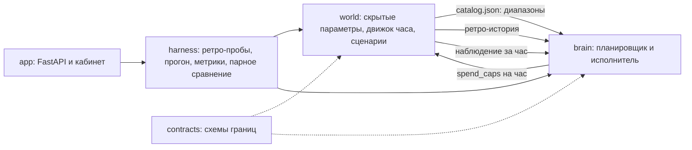

# MediaPlan Optimizer. Описание проекта, промежуточная версия

## Коротко

Мы делаем сервис, который сначала считает медиаплан по восьми каналам, а потом
ведёт кампанию по часам и не даёт ей уйти от плана. Рынок у нас заменён
симулятором, потому что настоящих площадок в кейсе нет. Сейчас всё уже
работает вместе: три демонстрации из кейса проходят, 148 тестов зелёные,
поднимается одной командой `docker compose up`. Код лежит здесь:
https://github.com/dmagog/mediaplan-optimizer

## Какую проблему решаем

Мы поговорили о том, как это устроено сейчас, и картина такая. Медиапланер
собирает план в Excel по средним бенчмаркам, тратит на это рабочий день,
а потом защищает распределение перед клиентом, не имея аргументов кроме
«так обычно». Если цель недостижима, об этом узнают уже во время кампании.
Трафик-менеджер после запуска сверяет факт с планом раз в день или реже и
перекладывает бюджет руками, и никто потом не может сказать, помогло это или
нет.

Общее у обеих ролей одно: человек смотрит на число, и ему не с чем его
сравнить. Каналы между собой, цель с ёмкостью рынка, сегодняшнюю цифру с
плановой, своё вмешательство с бездействием. По нашим прикидкам для кампании
в 1,2 млн на три недели опоздание с перераспределением 10–15 % бюджета стоит
120–180 тысяч. Если у команды двадцать-сорок таких кампаний в год и промах
случается в каждой четвёртой, это от полумиллиона до двух миллионов в год, не
считая времени людей.

## Что именно строим

По кейсу нужны три вещи в одном веб-кабинете: планировщик (бюджет и срок дают
максимум KPI, либо цель и срок дают нужный бюджет или честный отказ),
симулятор рынка с шагом в час и шоками, и сервис исполнения, который каждый
час сверяет накопленный факт с планом и перекладывает остаток. Критерии из
кейса мы приняли как есть: план полный и достижимый, всё воспроизводится по
зерну, отклонение в конце не больше 20 % по расходу и по KPI, а после шока
результат должен быть заметно ближе к плану, чем если бы план исполняли
буквально.

## Как решаем

Мы с самого начала договорились, что ничего не изобретаем. Все три части
кейса это известные задачи, и для каждой есть опубликованное решение.

Планировщик распределяет бюджет по правилу равенства предельных отдач. Это
Little и Lodish 1969 года, тот же принцип сидит в аллокаторах Google Meridian
и Meta Robyn. Кривые отклика «дневной бюджет → показы» мы строим не из
каталога, а из ретро-истории: пробных кампаний, прогнанных через публичный
интерфейс симулятора в прошлых мирах. Примерно так Google Reach Planner
прогнозирует по истории похожих кампаний. Задача типа B решается бисекцией по
бюджету. Внутри есть модель усталости от частоты, поэтому кривые вогнутые и
деньги не уходят все в один канал.

Симулятор написан по контракту, который согласовали с командой:
`reset / step / inject_shock`. Трафик по Пуассону с суточным профилем,
цена растёт с выкупом по лог-нормальному ландшафту, охват по модели
случайного размещения, шум AR(1). Важная деталь: случайность ключуется по
зерну, часу, каналу и типу события, поэтому две стратегии на одном зерне
видят один и тот же рынок, и сравнивать их честно. За образец брали
AuctionGym и открытый стенд пейсинга Yahoo. SMS идёт пакетами в окне 9–21.

Исполнение это два контура, как в Smart Pacing (Yahoo, KDD 2015). Внешний раз
в шесть часов перерешает остаток тем же аллокатором, но на кривых,
поправленных фактом. Внутренний держит темп множителем по полосам ошибки,
цель на час считается по формуле Turn. Детекторов два. Первый смотрит на клики
на рубль: сутки против трёх предыдущих с поправкой на плановую усталость и на
уровень расхода, порог 30 %, и он двусторонний: скачок CTR вверх при прежней
цене это подозрение на фрод, такой канал денег не получает, пока рост не
подтвердится конверсиями. Второй смотрит на конверсии на рубль, KPI кейса:
событий мало, поэтому окна длиннее. Тест значимости на 3σ стоит в обоих
детекторах: порог по величине сам по себе ловил бы шум. Честное следствие: падение CR на 40 % в маленьком канале за оставшиеся
дни неотличимо от шума, и детектор там молчит; вдвое в крупном канале ловит
за четверо суток. И есть резерв: если по KPI мы опережаем план, часть остатка
не тратим, и доля подбирается так, чтобы итоговый недорасход и итоговое
перевыполнение оказались равными.

Про числа. У нас правило: ни одной константы из головы. Бенчмарки со
ссылками лежат в `config/benchmarks.yaml`, допущения мира с диапазонами в
`config/assumptions.yaml`, константы исполнителя с источником или
калибровочным тестом в `config/controller.yaml`. Есть тест, который падает,
если у числа нет происхождения.

Схема:

Главное требование кейса, чтобы планировщик не подглядывал в параметры мира,
у нас закрыто механически: пакет `brain` не импортирует `world` (проверяет
import-linter и тест), а отдельный тест проверяет, что смена зерна мира не
меняет план.

## Что уже сделано

Контракты границ: каталог, наблюдение, действие, бриф, план, решение, итог.
Симулятор: три семейства каналов, девять сценариев шоков, шок из интерфейса
во время прогона, инварианты на каждом шаге. Планировщик: оба типа брифа,
диагноз недостижимости с готовыми ходами, фиксация канала, лимит CPA, коридор,
календарь, почасовая траектория. Исполнитель: наша адаптивная стратегия и три
базовых для сравнения (static, proportional pacing, PID). Стенд: ретро-пробы,
прогон, метрики, парное сравнение на N мирах. Кабинет: бриф с пресетами, план
с объяснением, утверждение версии, стресс-тест до запуска, «что если бюджет
±10 %», прогон с воспроизведением по часам, сводка на час, таблица каналов
за час, карточки ходов с кнопками одобрить и отклонить, итог по каналам,
сравнение стратегий на 20 мирах, стенд «где ломается решение». После
чекпоинта: пока ход ждёт решения, автоматика не добирает его частями, донор
заморожен; откат применённого хода; карточка в час слома, даже если
переносить некуда, с объяснением почему держим; лимит ±30 % на долю канала за
сутки, а не за перерешение; стенд на 100 мирах с распределением отклонений.
Плюс Docker, тесты, линтеры.

## Первые результаты

Демо 1: 1,2 млн на 21 день дают 2 280 конверсий, CPA 526 ₽, восемь каналов,
цена следующей конверсии выровнена в диапазоне 1 070–1 383 ₽: точно её
уравнять мешает шаг наливания, а выше всех она у каналов с мелкой ёмкостью.
Считается за 0,1 с.

Демо 2: 50 000 кликов за 14 дней. На всех каналах достижимо за 288 тысяч. На
узком пресете из четырёх каналов отказ: максимум 37 951 клик, связывает
набор каналов, и три хода с посчитанным бюджетом (срок, цель, каналы).

Демо 3: шок CTR −40 % в крупном канале с 240-го часа на одном мире. Наша
стратегия заканчивает с отклонением 7,2 % по KPI, заморозка с 9,0 %.
Детектор сработал в час 270, карточка о сломе в тот же час. Один мир мало что
доказывает, поэтому дальше стенд.

Стенд на 100 парных мирах, отклонение в конце кампании; «в пороге» это доля
миров, где и расход, и KPI отклонились не больше чем на 20 % (порог кейса):

| Сценарий | Заморозка: расход / медиана KPI / в пороге | Наша: расход / медиана KPI / в пороге | Побед по KPI |
|---|---|---|---|
| без шока | 2,2 % / 23,4 % / 45 % | 14,2 % / 16,9 % / 60 % | 84 % |
| CTR −40 % в крупном канале | 2,2 % / 18,8 % / 54 % | 12,3 % / 14,8 % / 65 % | 83 % |
| CPM ×2 | 1,9 % / 20,0 % / 50 % | 12,7 % / 15,5 % / 64 % | 84 % |
| пауза канала | 4,2 % / 21,8 % / 47 % | 14,0 % / 16,3 % / 61 % | 85 % |
| SMS-база −50 % | 2,2 % / 23,4 % / 45 % | 14,4 % / 17,8 % / 61 % | 86 % |

Читать это надо так. Заморозка тратит деньги ровно по плану, но KPI гуляет,
потому что каждый мир отличается от каталога: в половине миров она не
укладывается в порог. Наша стратегия по умолчанию уравнивает два отклонения:
в щедром мире часть бюджета не тратится, а перевыполнение остаётся таким же,
как недорасход. Оба отклонения в пороге в 60 % миров против 45 % у заморозки,
побед по KPI 83–86 %. Резерв это ручка: режим «держать KPI на плане» даёт
медиану отклонения по KPI 0,2 % и 90 % миров в пороге по KPI, но недорасход
в среднем 27 %; режим «выжимать максимум» тратит всё и перевыполняет план на
21 %; баланс между ними максимизирует долю миров с обоими отклонениями в
пороге (`results/modes_100.json`, `docs/business_position.md`). Гистограммы
по мирам в `docs/figures/stand_hist_*.png`: наша стратегия сжата вокруг
15–18 %, заморозка расползается до 120 %.

Детектор: без шока 0,21 срабатывания на кампанию (results/report.md,
сценарий stable), часть из них
статистически настоящие (выгорание маленького канала); CTR −40 % в крупном
канале ловится с задержкой около 30 часов; падение CR вдвое в крупном канале
по конверсиям за четверо суток; падение CR на 40 % в маленьком канале за
оставшиеся дни неотличимо от шума, и детектор там честно молчит.

## Ограничения, о которых мы знаем

Аудитории каналов у нас пересекаются только попарно, по 10 % меньшего пула
(в кейсе МТС AdTech пересечение трёх каналов по GFD 5,3 %). Цена задаётся ландшафтом, а не аукционом второй
цены. Охват по случайному размещению, а не NBD. Конверсии мгновенные. VTR по
допущению. MAPE по KPI как среднее
по часам 26–27 % у всех стратегий из-за разброса миров, хотя отклонение в конце
кампании 18,8 % у нашей стратегии против 26,6 % у заморозки (медианы 16,9 % и
23,4 %). И главное: каналы абстрактные, наши CPM и CTR не являются
статистикой какой-либо площадки.

## Что пока не решили

Одобрение и откат хода реализованы перепрогоном на тех же случайных числах,
для прототипа это честно, в продукте нужен журнал решений с состоянием.
Коридор плана ±34 % честно отражает неопределённость каталога, но выглядит
страшно, думаем показывать ±1σ или P25–P75. Резерв бюджета: держать план или
выжимать максимум, это продуктовый выбор, в кабинете есть переключатель.
Лимит полномочий в демо (50 000 ₽ в первом, 20 000 ₽ в третьем) стоит только
для показа сценария.
Интеграция мира от Тимофея: наш симулятор написан по общему контракту,
замена пакета не должна требовать правок мозга, но это надо проверить.

## До финала

Два уровня интерфейса: кабинет рекламодателя и технический стенд. Развитие
модели мира: сегменты аудитории, матрица пересечений между каналами, фрод,
сверка порядков величин с открытыми данными площадок. Стенд деградации при
смещении каталога, когда мир сильно не похож на бенчмарки. Проверка на людях:
три медиапланера и два трафик-менеджера. Отчёт, презентация, репетиция трёх
демо и живого прогона по брифу от жюри.

## Команда и распределение задач

**Родион Оркин, AI Engineer, оптимайзер (MLE #1).** Планировщик, исполнитель,
стенд, кабинет и интеграция. Сделано: пакеты `brain`, `harness`,
`contracts`, симулятор по общему контракту, кабинет, тесты, Docker, реестры
констант с источниками. Участие активное.

**Тимофей Лисоченко, AI Engineer, модель мира (MLE #2).** Контракт
симулятора, три профиля каналов, сценарии шоков, воспроизводимость. Сделано:
контракт `reset / step / inject_shock`, документ модели мира, требования к
инвариантам и общим случайным числам. Участие активное.

**Георгий Мамарин, AI Product.** Исследование пользователей, сценарии С1–С6,
критерии готовности, продуктовые материалы и презентация. Сделано:
кабинетное исследование по шести аудиториям, шесть сценариев, правило
«вторая величина», карточка с двумя ценами, лимит полномочий, стресс-тест до
запуска. Участие активное.
